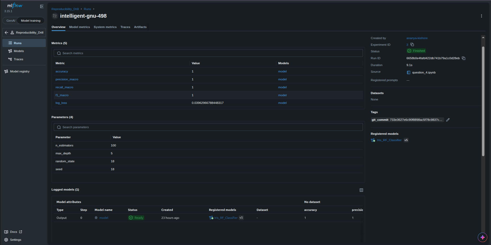

This is the private repository shared between

- Ananya Kishore (DA24B035)
- Aramati Chiru Thejaswi (DA24B036)

for question 4 of assignment 1 (DA3408). 

# Partner A (DA24B035):

I assumed the role of partner A.

I have recorded the metrics, parameters, the git commit and the model training the iris dataset on a Random Forest Classifier as can be seen below:



Partner B has to verify the following results:
### Metrics

| Metric          | Value                |
|------------------|-----------------------|
| accuracy         | 1                     |
| precision_macro  | 1                     |
| recall_macro     | 1                     |
| f1_macro         | 1                     |
| log_loss         | 0.03962966788448317   |

### Parameters

| Parameter     | Value |
|----------------|-------|
| n_estimators   | 100   |
| max_depth      | 5     |
| random_state   | 18    |
| seed           | 18    |

### Logged Model

| Type   | Model Name | Stage   | Registered Model       | accuracy | precision |
|--------|------------|---------|------------------------|---------|----------|
| Output | model      | Staging | Iris_RF_Classifier     | 1      | 1        |

### To run the notebook and recreate Partner A's work:

Install Miniforge, if it does not already exist on your system.

Instead of a requirements.txt, you can recreate the same environment shared with partner B in `environment.yml`:

```bash
wget "https://github.com/conda-forge/miniforge/releases/latest/download/Miniforge3-$(uname)-$(uname -m).sh"
bash Miniforge3-$(uname)-$(uname -m).sh
```

Close and reopen your terminal. In the new terminal, run:

```bash
mamba env create -f environment.yml
mamba activate assignment1_env

jupyter nbconvert --to notebook --execute question_4.ipynb --inplace
```

In a separate terminal, run:

```bash
mlflow server \
  --backend-store-uri sqlite:///mlflow.db \
  --default-artifact-root ./mlruns \
  --host 0.0.0.0 \
  --port 5000 \
  --allowed-hosts "*" \
  --cors-allowed-origins "http://localhost:5000,http://127.0.0.1:5000"
```

- Open `http://localhost:5000` in your browser.
- Under **Experiments**, you will see `Reproducibility_Drill`. Click on the run visible to see all the logged metrics, the git commit tag, the logged model, etc.

### To version the data and export to partner B:

```bash
git init
dvc init
dvc remote add -d myremote s3://da3408-ananya-s3/dvc_storage # s3 remote I used
git add .dvc/config

dvc add Iris.csv
dvc push
git add environment.yml Iris.csv.dvc .gitignore
git commit -m "versioned iris dataset, configured env"

git remote add origin git@github.com:AnanyaKishore/q4demo.git # private repo shared with partner B
git branch -M main
git push -u origin main

git add question_4.ipynb
git commit -m "code added"
git push
```

# Partner B (DA24B036):
I assumed the role of Partner B and reproduced Partner A's result using only the permitted commands: 
git clone, git checkout <commit>, dvc checkout, mamba env create -f environment.yml, and rerunning the script 

Steps performed:

* Cloned the repository and checked out commit 7feab49 (Partner A's latest commit, containing the trained model, versioned dataset, and environment).
* Retrieved the versioned Iris dataset using dvc pull and dvc checkout.
* Recreated the exact environment using mamba env create -f environment.yml.
* Reran question_4.ipynb 
* Reproduced MLflow run: brawny-squid-212 (Run ID: 7328e02c7a02428fb32d48ff33c94456), which auto-logged a git_commit tag matching 7feab49, confirming the exact commit was used.
Results produced:


